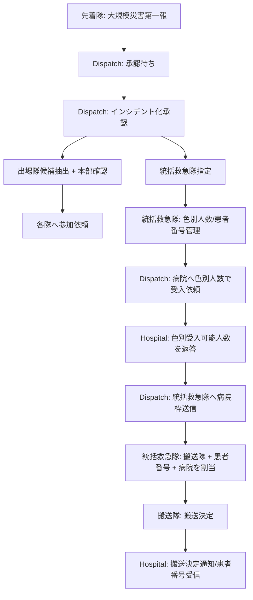

# 大規模災害トリアージ インシデント指揮設計

作成日: 2026-04-27

## 目的

- トリアージモード発動時に、複数隊・多数傷病者・複数病院受入枠を `大規模災害インシデント` 単位で扱う。
- 平時の `1事案 -> 病院選定 -> 搬送決定` ではなく、`現場インシデント -> 色別人数報告 -> 病院枠確保 -> 統括救急隊による搬送配分` を正本にする。
- 病院への初回依頼は個別患者詳細より、災害概要と色別人数を重視する。

## 決定事項

### インシデント作成

- 先着隊が `大規模災害第一報` を本部へ送信する。
- 本部が第一報を承認した時点で `大規模災害インシデント` として正式化する。
- 第一報送信隊は `作成隊` かつ `統括救急隊候補` として登録する。
- インシデント化した事案に出場中の各隊へ `インシデント参加依頼通知` を送る。
- 出場隊の特定は `自動候補抽出 + 本部確認` とする。

### 統括救急隊

- 現場隊は `統括救急隊を担当します` と本部へ申告できる。
- 本部は申告を基に統括救急隊を指定する。
- 指定された隊へ `統括救急隊指定通知` を送る。
- 同一災害出場中の各隊の画面には、統括救急隊がどこかを常時表示する。
- 本部は統括救急隊を後から変更できる。

### 出場隊状態

- dispatch は同一災害出場隊の接続状態と operational mode を確認できる。
- TRIAGEモードになっていない隊へ、個別または一括で `TRIAGE切替依頼通知` を送れる。
- 本部はEMS端末のモードを強制変更しない。切替操作は各EMS側で実行する。

### 傷病者番号

- 内部番号は色に依存しない `P-001`, `P-002`, `P-003` とする。
- 表示上は現在色を付けて `赤 P-001`, `黄 P-002`, `緑 P-003` とする。
- START/PAT再評価で色が変わっても番号は変えない。
- 各隊は傷病者を仮登録できる。
- 統括救急隊が仮登録を承認し、正式番号化する。

### 統括救急隊の権限

- 色別人数報告を作成・更新できる。
- 傷病者番号を発行できる。
- 各隊の仮登録傷病者を承認・統合・差戻しできる。
- START/PAT結果と色を更新できる。
- 本部から届いた受入可能病院枠を基に、搬送隊と傷病者番号を割り当てられる。
- 搬送割当を各搬送隊へ送信できる。
- 本部は必要時に統括救急隊の指定変更と上書き操作ができる。

### 病院への初回依頼情報

- 初回依頼は患者個別詳細を主にしない。
- 送信項目は以下に限定する。
  - 災害概要
  - START法による結果人数: 赤 / 黄 / 緑 / 黒
  - PAT/解剖学的評価による結果人数: 赤 / 黄 / 緑 / 黒
  - 備考
- 病院は色別に受入可能人数を返す。
  - 赤
  - 黄
  - 緑
  - 黒
  - 備考
- 患者個別情報は、統括救急隊が `搬送隊 + 傷病者番号 + 搬送先病院` を確定した後に病院へ送る。

## 推奨データモデル

### `triage_incidents`

- `id`
- `incident_code`
- `source_case_uid`
- `status`: `PENDING_APPROVAL | ACTIVE | CLOSED`
- `address`
- `summary`
- `notes`
- `created_by_team_id`
- `approved_by_dispatch_user_id`
- `command_team_id`
- `start_red_count`
- `start_yellow_count`
- `start_green_count`
- `start_black_count`
- `pat_red_count`
- `pat_yellow_count`
- `pat_green_count`
- `pat_black_count`
- `created_at`
- `approved_at`
- `closed_at`

### `triage_incident_teams`

- `incident_id`
- `team_id`
- `role`: `CREATOR | COMMAND_CANDIDATE | COMMANDER | TRANSPORT`
- `participation_status`: `REQUESTED | JOINED | ARRIVED | AVAILABLE | ASSIGNED | LEFT`
- `operational_mode_at_request`: `STANDARD | TRIAGE`
- `triage_mode_requested_at`
- `triage_mode_acknowledged_at`
- `last_seen_at`

### `triage_patients`

- `incident_id`
- `patient_no`: `P-001` 形式
- `registration_status`: `DRAFT | PENDING_COMMAND_REVIEW | CONFIRMED | MERGED | CANCELLED`
- `current_tag`: `RED | YELLOW | GREEN | BLACK`
- `start_tag`
- `pat_tag`
- `injury_details`
- `registered_by_team_id`
- `confirmed_by_team_id`
- `assigned_team_id`
- `assigned_hospital_id`
- `transport_assignment_id`

### `triage_hospital_requests`

- `incident_id`
- `request_id`
- `hospital_id`
- `disaster_summary`
- `start_counts`
- `pat_counts`
- `notes`
- `status`: `UNREAD | READ | NEGOTIATING | ACCEPTABLE | NOT_ACCEPTABLE`

### `triage_hospital_offers`

- `request_id`
- `hospital_id`
- `red_capacity`
- `yellow_capacity`
- `green_capacity`
- `black_capacity`
- `notes`
- `responded_at`

### `triage_transport_assignments`

- `incident_id`
- `hospital_offer_id`
- `hospital_id`
- `team_id`
- `patient_ids`
- `status`: `DRAFT | SENT_TO_TEAM | TRANSPORT_DECIDED | TRANSPORT_DECLINED | ARRIVED`
- `assigned_by_team_id`
- `sent_at`
- `decided_at`

## 画面方針

### EMS

- TRIAGE中に `大規模災害インシデント` バナーを表示する。
- インシデント参加依頼を通知で受け、参加状態を返せる。
- 同一インシデントの統括救急隊を常時表示する。
- 統括救急隊に指定された隊だけ、色別人数報告、患者番号確定、搬送割当を操作できる。
- 搬送隊は割当を受け、傷病者番号と搬送先を確認して搬送決定を押す。

### Dispatch

- 大規模災害第一報を `承認待ち` として表示する。
- 承認後、候補出場隊を自動抽出し、本部が追加・除外して参加依頼を送る。
- 統括救急隊候補から統括救急隊を指定する。
- 各隊の接続状態、参加状態、TRIAGEモード状態を一覧で確認する。
- 未切替隊へTRIAGE切替依頼を送る。
- 色別人数を基に病院へ初回受入依頼を送る。
- 病院からの色別受入可能人数を統括救急隊へ送信する。

### Hospital

- 病院側にTRIAGEモードは追加しない。
- 通常画面内に `大規模災害受入依頼` として表示する。
- 初回依頼では災害概要、START/PAT別色別人数、備考を確認する。
- 色別受入可能人数と備考をdispatchへ返す。
- 搬送決定後に、該当患者番号と必要最小限の患者詳細を受信する。

## 状態遷移

## 非目標

- 本部がEMS端末のTRIAGEモードを強制変更すること。
- 病院側に独立したTRIAGEモードを持たせること。
- 初回受入依頼で全患者詳細を病院へ送ること。
- 既存の平時病院選定フローを置き換えること。

## 段階導入

1. DB foundation: incident / teams / patients / offers / assignments を追加する。
2. Dispatch: 第一報承認、統括指定、参加依頼、TRIAGE切替依頼を実装する。
3. EMS: インシデント参加、統括表示、統括候補申告、統括指定通知を実装する。
4. Dispatch/Hospital: 色別人数ベースの受入依頼と色別受入可能人数返答を実装する。
5. Commander EMS: 患者番号確定、搬送隊・病院枠割当、搬送隊通知を実装する。
6. 搬送隊/Hospital: 搬送決定、病院通知、患者番号・必要最小情報表示を実装する。

## 検証方針

- E2Eで以下を固定する。
  - 先着隊が第一報を送る。
  - dispatchが承認してインシデント化する。
  - dispatchが統括救急隊を指定し、全隊に統括救急隊が表示される。
  - STANDARD隊にTRIAGE切替依頼を送れる。
  - dispatchが色別人数で病院へ依頼する。
  - 病院が色別受入可能人数を返す。
  - 統括救急隊が隊と患者番号を選んで搬送割当を送る。
  - 搬送隊が搬送決定し、病院に通知される。
