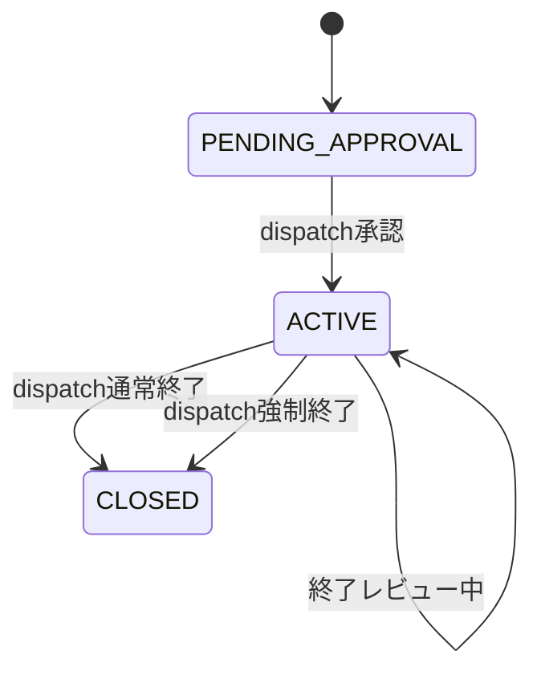
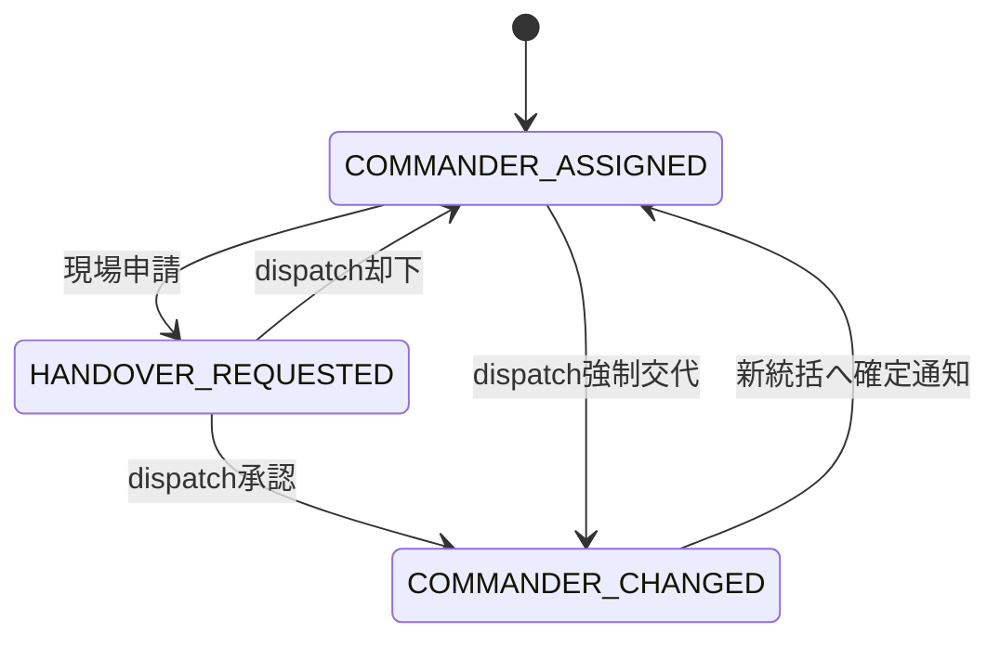
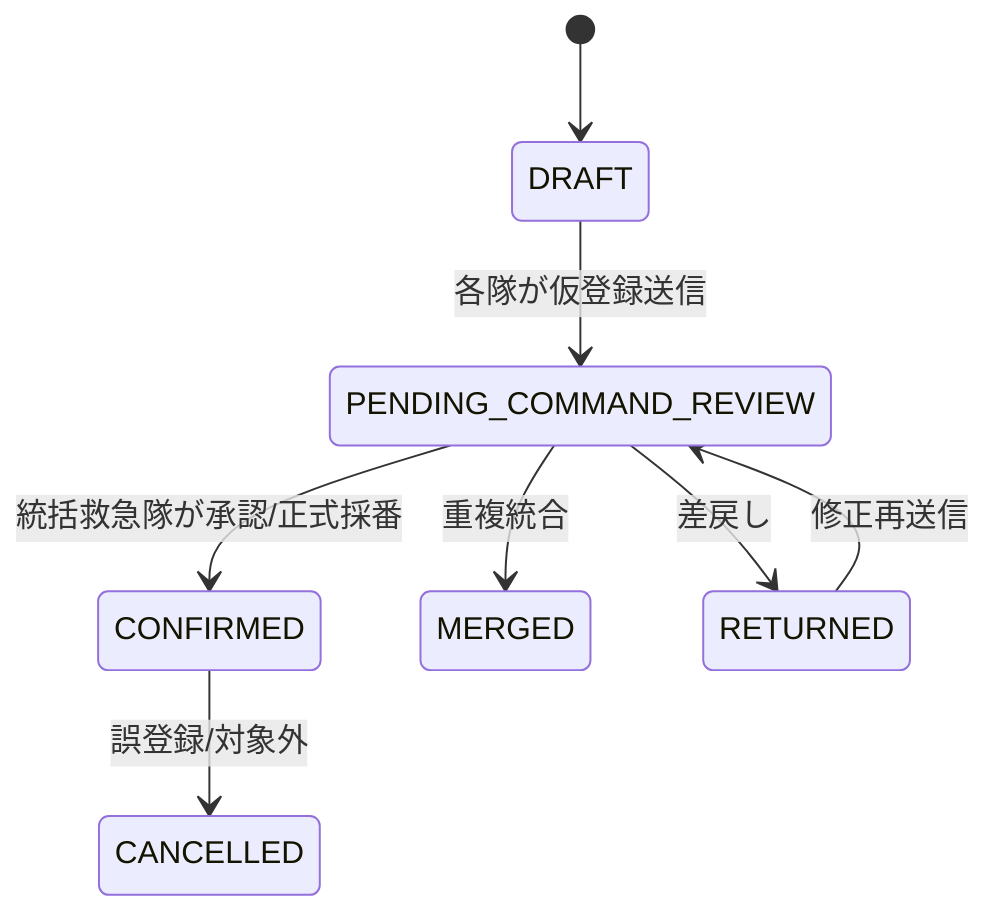
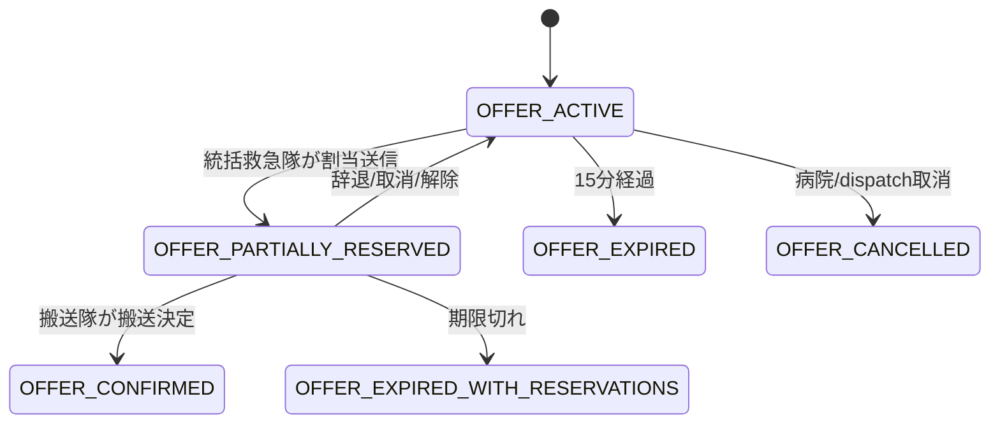
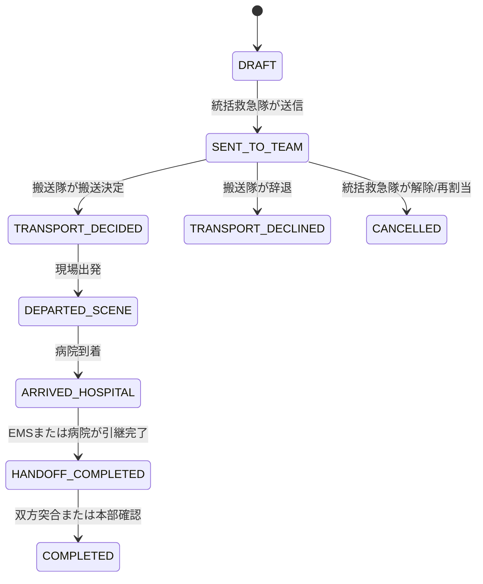

# 大規模災害トリアージ P0 要件・状態設計

作成日: 2026-05-05

## 目的

- 2026-04-27 に実装した大規模災害トリアージインシデント指揮を、次フェーズで安全に拡張するための要件正本を作る。
- 今回はすぐにリリースしない前提で、実装前に `仕様書 + DB設計 + 状態遷移 + API契約 + 受入テスト観点` を固定する。
- 成功時の50名搬送happy pathだけでなく、交代、取消、再割当、通信断、監査、終了処理までをP0要件として扱う。

## 現状前提

- 既存の基礎設計は [2026-04-27-mci-triage-incident-command-design.md](/C:/practice/medical-support-apps/docs/plans/2026-04-27-mci-triage-incident-command-design.md) を正とする。
- 既存実装記録は [2026-04-27-mci-triage-incident-command-implementation.md](/C:/practice/medical-support-apps/docs/plans/2026-04-27-mci-triage-incident-command-implementation.md) を参照する。
- 既存E2Eでは、11隊、50名、2病院への分配と全員搬送決定までを確認している。
- 病院側に独立したTRIAGEモードは作らない。通常の病院画面内にMCI受入依頼と搬送予定を表示する。
- 既存DBには `triage_incidents.mode` として `LIVE | TRAINING` がある。訓練/本番分離はこの既存列を使い、新しい `incident_environment` は追加しない。
- EMSの `STANDARD | TRIAGE` は operational mode、事案/インシデントの `LIVE | TRAINING` は app data mode として別概念のまま扱う。

## 設計レビュー反映

- `triage_incidents.status` は現行の `PENDING_APPROVAL | ACTIVE | CLOSED` を維持する。終了レビューや強制終了は `closure_type`、`closure_reason`、`closing_review_started_at` で表現し、statusの追加で既存queryを壊さない。
- 傷病者仮登録は現行 `triage_patients.patient_no NOT NULL UNIQUE` と衝突するため、migrationでは `patient_no` をnullable化し、正式番号は `CONFIRMED` 時にのみ採番する。仮登録中は `provisional_patient_no` を表示番号として使う。
- `patient_no` の一意性は `patient_no IS NOT NULL` のpartial unique indexへ移行する。既存の `P-001` 形式データはそのまま維持する。
- 搬送ステータスは既存の `DRAFT` と `ARRIVED` を考慮する。実装時は `ARRIVED` を `ARRIVED_HOSPITAL` へbackfillし、必要なら `DRAFT` は互換値として残す。
- STARTとPATは別ロジックなので、患者には `start_algorithm_version_id` と `pat_algorithm_version_id` を分けて保存する。単一の `triage_algorithm_version_id` では不足する。
- 病院枠の残数は新規ledgerではなく、当面は `triage_transport_assignments.status` と患者タグ集計をsource of truthにする。監査ログは枠操作の説明責任に使い、枠残数の正本にはしない。
- 監査ログの `before_payload` / `after_payload` は自由記載の外傷詳細などを丸ごと保存しない。ID、変更前後のstatus/tag/count、理由、時刻を中心にして、医療情報の重複保存を最小化する。

## 対話で確定した判断

| 論点 | 決定 |
| --- | --- |
| 統括救急隊の交代 | 現場から申請可能。最終指定権限は本部dispatch。通信断、無応答、誤指定、搬送出発時は本部が強制交代可能。 |
| 傷病者登録 | 各出場隊が仮登録し、統括救急隊が承認、統合、差戻しを行い、正式番号 `P-001` 形式で採番する。 |
| 色判定 | START/PAT入力で自動判定。統括救急隊は理由入力付きで手動上書き可能。変更履歴を保存する。 |
| 病院受入枠の有効期限 | 色別受入可能人数には有効期限を持たせる。初期値は15分。期限切れ後は再確認が必要。 |
| 病院枠の消費 | 統括救急隊が `搬送隊 + 傷病者 + 病院` を送信した時点で仮消費。搬送隊が搬送決定した時点で確定消費。辞退、取消、タイムアウト時は仮消費を解放する。 |
| 搬送隊の未応答 | 5分で警告、10分で再割当推奨を表示する。自動解除はせず、統括救急隊が判断する。 |
| 搬送ステータス | `割当済み -> 搬送決定 -> 現場出発 -> 病院到着 -> 引継完了 -> 完了` を基本遷移にする。 |
| 病院側の搬送受信 | 病院は搬送決定通知を `搬送予定` として受信し、到着後に `受入確認/引継完了` を押せる。 |
| 通信障害時の正本 | サーバー/本部dispatchの最新確定状態を正本にする。オフライン入力は復旧後に差分候補として取り込み、競合時は手動解決する。 |
| オフライン中のEMS操作 | 自隊に閉じる傷病者仮登録、START/PAT入力、外傷詳細、自隊搬送ステータスのみ許可。病院割当、枠消費、統括交代はオンライン必須。 |
| 監査ログ | 統括指定/交代、採番、色変更、病院依頼/回答、枠消費/解放、搬送割当、ステータス、取消/再割当を専用監査ログに残す。 |
| 通知エスカレーション | 重要通知は即時、3分未読で再通知、5分未読で本部/統括画面に固定警告。病院依頼は5分未返信で本部に再確認候補を出す。 |
| 終了条件 | 全傷病者が `完了/キャンセル/黒タグ処理済み` のいずれかになり、未消費の仮枠が解放され、本部dispatchが最終確認して終了する。 |
| START/PATロジック | 判定ロジックをバージョン管理し、地域MC/管理者が承認した版だけを本番利用可能にする。各傷病者には判定ロジックのバージョンを保存する。 |
| 終了後レポート | インシデント単位で時系列、各隊、傷病者、色変更、病院依頼/回答、搬送、監査ログをPDF/CSV出力可能にする。 |
| 訓練モード | 既存の `mode: LIVE | TRAINING` で本番/訓練を分ける。画面、通知、レポート、監査ログに訓練表示を残す。 |
| 実装順 | 状態遷移、権限、監査ログ、病院枠ロックを先に固め、その後UIを広げる。 |
| 今回の完了ライン | すぐには実装せず、設計書を正本化してから次フェーズ実装に入る。 |

## P0 スコープ

### 含める

- 統括救急隊の交代申請、dispatch承認、dispatch強制交代。
- 各隊の傷病者仮登録と、統括救急隊による承認、統合、差戻し、正式採番。
- START/PAT自動判定、統括救急隊の理由付き上書き、色変更履歴。
- 病院色別受入枠の有効期限、仮消費、確定消費、解放、再確認。
- 搬送割当後の後続ステータス管理。
- 病院側の搬送予定、受入確認、引継完了。
- オフライン時の操作制限と復旧後の差分候補取り込み。
- 専用監査ログ。
- 重要通知の再通知、固定警告、病院未返信警告。
- MCIインシデントの通常終了、強制終了、終了後CSV/PDFレポート要件。
- 訓練/本番分離。

### 含めない

- EMS端末のTRIAGEモード強制切替。
- 病院側の独立TRIAGEモード。
- 端末間のマルチマスター同期。
- 監査ログの物理削除機能。
- 医療判断そのものの自動確定。自動判定は入力支援であり、承認済みロジックと現場判断の履歴を残す。

## 状態遷移

### インシデント

- DB上の `status` は既存互換のため `PENDING_APPROVAL | ACTIVE | CLOSED` を維持する。
- 終了レビュー中かどうかは `closing_review_started_at` と終了前check結果で表現する。
- 強制終了は `status = CLOSED` とし、`closure_type = FORCED` で通常終了と区別する。
- 強制終了時は理由入力、未完了患者数、未解放枠、実行者を監査ログに残す。
- 既存 `ACTIVE` queryが多いため、migrationではstatus追加より補助列追加を優先する。

### 統括救急隊

- 旧統括隊は交代後、搬送隊または参加隊として残れる。
- 新旧統括隊、全参加隊、本部に通知する。
- 通信断による強制交代は `last_seen_at` と未応答時間を根拠として記録する。

### 傷病者登録

- 正式番号は `CONFIRMED` 時に発番する。
- `DRAFT` / `PENDING_COMMAND_REVIEW` / `RETURNED` は `patient_no = NULL`、`provisional_patient_no` ありで保存する。
- `MERGED` は統合先の正式番号を必ず保持する。
- 色変更は `registration_status` ではなく、別の履歴イベントで管理する。

### 病院受入枠

- 期限切れの枠は新規割当に使えない。
- すでに `SENT_TO_TEAM` の仮消費がある場合、統括救急隊に再確認/解除判断を促す。
- 実装では、色別の `available`, `reserved`, `confirmed`, `remaining` を同一transactionで算出する。

### 搬送割当

- `SENT_TO_TEAM` から5分未応答で警告、10分未応答で再割当推奨を表示する。
- 自動解除はしない。
- `TRANSPORT_DECLINED` と `CANCELLED` は仮消費枠を解放する。
- 既存 `ARRIVED` はmigration時に `ARRIVED_HOSPITAL` へ変換する。互換期間中だけ読み取り側で `ARRIVED` を到着扱いにしてもよい。

## 推奨DB変更案

### `triage_incidents` 拡張

- 既存 `mode`: `LIVE | TRAINING` を継続利用する。新規の本番/訓練列は追加しない。
- `closure_type`: `NORMAL | FORCED | CANCELLED`
- `closure_reason`
- `closing_review_started_at`
- `closed_by_dispatch_user_id`
- `force_closed_at`

### `triage_incident_command_transitions` 追加

- `id`
- `incident_id`
- `from_team_id`
- `to_team_id`
- `requested_by_team_id`
- `approved_by_dispatch_user_id`
- `transition_type`: `REQUESTED | APPROVED | REJECTED | FORCED`
- `reason`
- `created_at`
- `resolved_at`

### `triage_patients` 拡張

- `patient_no` をnullable化する。
- `provisional_patient_no`
- `merged_into_patient_id`
- `returned_reason`
- `cancel_reason`
- `start_algorithm_version_id`
- `pat_algorithm_version_id`
- `black_tag_handled_at`
- `black_tag_handled_by_user_id`

Migration note:

- 既存の `UNIQUE (incident_id, patient_no)` はdropし、`patient_no IS NOT NULL` のpartial unique indexへ置き換える。
- 既存データは全て正式採番済み扱いなのでbackfill不要。新規仮登録だけ `patient_no = NULL`、`provisional_patient_no` ありで保存する。
- 一覧のORDER BYは `COALESCE(patient_no, provisional_patient_no), id` に変更する。

### `triage_patient_tag_events` 追加

- `id`
- `patient_id`
- `incident_id`
- `previous_tag`
- `next_tag`
- `start_tag`
- `pat_tag`
- `assessment_payload`
- `change_source`: `AUTO_START | AUTO_PAT | MANUAL_OVERRIDE | RETRIAGE`
- `override_reason`
- `start_algorithm_version_id`
- `pat_algorithm_version_id`
- `changed_by_user_id`
- `changed_by_team_id`
- `created_at`

### `triage_algorithm_versions` 追加

- `id`
- `algorithm_type`: `START | PAT`
- `version`
- `status`: `DRAFT | APPROVED | RETIRED`
- `definition`
- `approved_by_user_id`
- `approved_at`
- `effective_from`
- `retired_at`

### `triage_hospital_offers` 拡張

- `offer_status`: `ACTIVE | EXPIRED | CANCELLED | EXHAUSTED | SUPERSEDED`
- `expires_at`
- `cancelled_at`
- `cancelled_by_user_id`
- `cancel_reason`
- `superseded_by_offer_id`

### `triage_transport_assignments` 拡張

- `status`: `DRAFT | SENT_TO_TEAM | TRANSPORT_DECIDED | TRANSPORT_DECLINED | DEPARTED_SCENE | ARRIVED_HOSPITAL | HANDOFF_COMPLETED | COMPLETED | CANCELLED`
- `declined_at`
- `decline_reason`
- `departed_scene_at`
- `arrived_hospital_at`
- `handoff_completed_at`
- `hospital_accepted_at`
- `hospital_accepted_by_user_id`
- `hospital_handoff_completed_at`
- `hospital_handoff_completed_by_user_id`
- `completed_at`
- `cancelled_at`
- `cancel_reason`
- `last_status_updated_by_user_id`
- `last_status_updated_by_team_id`

Migration note:

- 既存 `ARRIVED` は `ARRIVED_HOSPITAL` へbackfillしてからCHECK制約を更新する。
- 既存 `DRAFT` は互換値として残し、通常作成では `SENT_TO_TEAM` を使う。

### `triage_audit_events` 追加

- `id`
- `incident_id`
- `actor_user_id`
- `actor_team_id`
- `actor_role`
- `event_type`
- `target_type`
- `target_id`
- `before_payload`
- `after_payload`
- `reason`
- `created_at`

Payload policy:

- `before_payload` / `after_payload` は、status、tag、capacity、target idなどの差分に絞る。
- 自由記載の外傷詳細、氏名、電話番号などを丸ごと複製しない。
- レポート生成時は監査ログと正本テーブルを結合して復元し、監査ログ自体を医療情報の二重保管先にしない。

### `triage_incident_reports` 追加

- `id`
- `incident_id`
- `report_type`: `CSV | PDF`
- `report_status`: `QUEUED | READY | FAILED`
- `storage_path`
- `generated_by_user_id`
- `generated_at`

## API契約案

### Dispatch

- `POST /api/dispatch/mci-incidents/[incidentId]/command-transitions`
  - 統括交代の承認、却下、強制交代。
- `POST /api/dispatch/mci-incidents/[incidentId]/hospital-offers/[offerId]/refresh`
  - 期限切れまたは期限間近の病院枠を再確認する。
- `POST /api/dispatch/mci-incidents/[incidentId]/close`
  - 通常終了または強制終了。
- `GET /api/dispatch/mci-incidents/[incidentId]/audit-events`
  - インシデント監査ログ。
- `POST /api/dispatch/mci-incidents/[incidentId]/reports`
  - CSV/PDFレポート生成要求。

### EMS

- `POST /api/ems/mci-incidents/[incidentId]/command-transition-requests`
  - 現場から統括交代を申請する。
- `POST /api/ems/mci-incidents/[incidentId]/patients/provisional`
  - 各隊が傷病者を仮登録する。
- `PATCH /api/ems/mci-incidents/[incidentId]/patients/[patientId]/review`
  - 統括救急隊が承認、統合、差戻し、取消を行う。
- `POST /api/ems/mci-incidents/[incidentId]/patients/[patientId]/tag-events`
  - START/PAT再評価または理由付き手動上書き。
- `PATCH /api/ems/mci-transport-assignments/[assignmentId]/status`
  - 搬送決定、辞退、現場出発、病院到着、引継完了。

### Hospital

- `PATCH /api/hospitals/mci-requests/[requestId]`
  - 既存の色別受入可否返信に `expiresAt` と取消/更新を追加する。
- `PATCH /api/hospitals/mci-transport-assignments/[assignmentId]/handoff`
  - 病院側の受入確認、引継完了。

### Admin / Medical Control

- `POST /api/admin/triage-algorithm-versions`
  - START/PAT判定ロジックのドラフト作成。
- `POST /api/admin/triage-algorithm-versions/[versionId]/approve`
  - 地域MC/管理者承認。
- `POST /api/admin/triage-algorithm-versions/[versionId]/retire`
  - 旧版停止。

API implementation notes:

- `incidentId`、`patientId`、`assignmentId`、`hospitalOfferId`、`targetTeamId` はリクエストbodyを信用せず、repository内で incident/team/hospital scope を再確認する。
- 統括救急隊操作は `assertCommanderAccess` 相当のserver-side checkを必須にする。UI表示制御だけで許可しない。
- dispatchの例外補正操作は通常操作と別API actionに分け、理由入力と監査ログを必須にする。
- hospital操作は `user.hospitalId` と対象request/assignmentの `hospital_id` が一致する場合だけ許可する。
- 患者仮登録の承認、統合、差戻し、色変更、搬送割当、搬送ステータス更新は同一transaction内で正本更新と監査ログ記録を行う。

## 権限案

| 操作 | Dispatch | 統括救急隊 | 搬送隊 | Hospital | Admin/MC |
| --- | --- | --- | --- | --- | --- |
| インシデント承認 | 可 | 不可 | 不可 | 不可 | 閲覧のみ |
| 統括交代申請 | 可 | 可 | 可 | 不可 | 不可 |
| 統括交代承認/強制交代 | 可 | 不可 | 不可 | 不可 | 不可 |
| 傷病者仮登録 | 不可 | 可 | 可 | 不可 | 不可 |
| 仮登録承認/統合/差戻し | 例外可 | 可 | 不可 | 不可 | 不可 |
| 色判定手動上書き | 例外可 | 可 | 不可 | 不可 | 不可 |
| 病院初回依頼 | 可 | 不可 | 不可 | 不可 | 不可 |
| 病院受入回答 | 不可 | 不可 | 不可 | 自院のみ可 | 不可 |
| 搬送割当 | 例外可 | 可 | 不可 | 不可 | 不可 |
| 搬送ステータス更新 | 閲覧/例外補正 | 自隊分可 | 自隊分可 | 到着/引継のみ可 | 不可 |
| インシデント終了 | 可 | 終了申請可 | 不可 | 不可 | 閲覧のみ |
| 判定ロジック承認 | 不可 | 不可 | 不可 | 不可 | 可 |

Security notes:

- `Admin/MC` は現行roleでは未分化のため、次フェーズでは `ADMIN` 内の権限フラグで始めるか、`MEDICAL_CONTROL` roleを追加するかをmigration前に決める。
- 監査ログ閲覧はdispatch/admin中心に制限し、病院・EMSには自組織に関係する履歴だけを表示する。
- 訓練データ一括リセット時も監査ログは削除しない。既存TRAINING reset方針と同じく、訓練であることをpayloadまたはincident modeで判別できるようにする。

## UI方針

### Dispatch

- MCI incident panelに、統括交代、未応答隊、未TRIAGE隊、期限切れ病院枠、未返信病院をまとめた警告列を追加する。
- 統括交代は `申請一覧` と `強制交代` を分ける。
- 期限切れ病院枠は新規割当対象から外し、再確認CTAを表示する。
- 終了レビュー画面では、未完了傷病者、未解放仮枠、未完了搬送、未読重要通知を一覧表示する。

### EMS 統括救急隊

- `仮登録レビュー`、`傷病者台帳`、`病院枠/搬送割当`、`未応答割当` を同一workspace内で切り替えられるようにする。
- 仮登録の統合では、統合元と統合先を比較し、正式番号を1つだけ残す。
- 色変更時はSTART/PAT自動判定結果、現在色、上書き理由を同時に見せる。
- 搬送割当は期限切れ枠を選べないようにする。

### EMS 搬送隊

- 受信した割当は大きなステータスボタンで `搬送決定`、`現場出発`、`病院到着`、`引継完了` を順に押せるようにする。
- 辞退時は理由入力を必須にする。
- オフライン時は自隊に閉じた入力だけ可能であることを画面上に明示する。

### Hospital

- MCI受入依頼は通常の選定依頼一覧内で表示する。
- 色別受入可能人数の返信時に、有効期限を表示する。初期値は15分。
- 搬送決定後は `搬送予定` として、搬送隊、傷病者番号、色、外傷詳細を表示する。
- 到着後に `受入確認/引継完了` を押せるが、病院側にTRIAGEモード切替は作らない。

### Admin / MC

- START/PATロジックのバージョン、承認状態、適用開始日、停止日を確認できる。
- 本番インシデントで使えるのは `APPROVED` かつ有効期間内の版だけにする。

## 通知・エスカレーション

- 統括指定、統括交代、搬送割当、病院受入回答、病院枠期限切れは重要通知にする。
- 重要通知は即時送信し、3分未読で再通知、5分未読で本部/統括画面に固定警告を出す。
- 病院受入依頼は5分未返信で本部dispatchに再確認候補を出す。
- 通知の既読、再通知、固定警告表示も監査ログまたは通知イベントとして追跡可能にする。

## オフライン方針

- 正本はサーバー/本部dispatchの最新確定状態。
- EMSオフライン時に許可するのは、自隊の仮登録、START/PAT入力、外傷詳細、自隊搬送ステータスだけ。
- 病院割当、病院枠消費、統括交代、インシデント終了はオンライン必須。
- 復旧後はオフライン入力を差分候補として提示し、競合時は自動上書きしない。
- 既存の [offline.md](/C:/practice/medical-support-apps/docs/workstreams/offline.md) の競合方針をMCI患者登録へ拡張する。

## 受入テスト観点

1. 統括交代
   - 統括救急隊が交代申請し、dispatch承認後に全参加隊の統括表示が変わる。
   - dispatchが通信断を理由に強制交代し、理由と時刻が監査ログに残る。
2. 傷病者仮登録
   - 複数隊が仮登録し、統括救急隊が承認、統合、差戻しを行える。
   - 統合後、統合元番号で搬送割当できない。
3. 色判定履歴
   - START/PAT自動判定後、統括救急隊が理由付き上書きを行い、履歴に変更前後、理由、変更者、版が残る。
4. 病院枠期限
   - 病院が赤3、黄6、緑20の枠を返し、15分経過後は新規割当に使えない。
   - 再確認後、新しい期限で割当可能になる。
5. 枠仮消費と解放
   - 統括救急隊が割当送信した時点で枠が仮消費される。
   - 搬送隊が辞退すると仮消費枠が解放される。
   - 搬送決定後は確定消費になり、同じ枠を再利用できない。
6. 未応答警告
   - 割当後5分で警告、10分で再割当推奨が統括画面に表示される。
   - 自動解除はされない。
7. 搬送ステータス
   - 搬送決定、現場出発、病院到着、引継完了、完了まで進められる。
   - 逆順更新や終端後更新は拒否される。
8. 病院突合
   - EMSが病院到着を押し、病院が受入確認/引継完了を押した時刻を突合できる。
9. オフライン制限
   - EMSオフライン中は病院割当、統括交代、インシデント終了が実行できない。
   - 復旧後、仮登録が差分候補として表示される。
10. インシデント終了
    - 未完了患者、未解放仮枠、未完了搬送がある場合、通常終了できない。
    - 強制終了時は理由必須で監査ログに残る。
11. 訓練モード
    - 訓練インシデントは画面、通知、レポート、監査ログで常時訓練表示になる。
    - 本番インシデント一覧と誤認しない。
12. レポート
    - 終了後、CSVで傷病者、病院、搬送、監査イベントを出力できる。

## 実装順

1. DB migration draftを作る。
2. repository層で状態遷移と監査ログをtransaction化する。
3. 権限ガードを追加する。
4. 病院枠の期限、仮消費、確定消費、解放をAPIで固定する。
5. 統括交代、仮登録レビュー、色変更履歴、搬送ステータスAPIを追加する。
6. Dispatch、EMS、Hospital UIに最小導線を追加する。
7. E2EでP0受入テストを固定する。
8. CSVレポートを追加し、PDFは後続フェーズで実装する。

## 未決事項

- 病院枠の標準有効期限15分を、病院ごとまたはインシデントごとに変更可能にするか。
- 黒タグ処理済みの詳細項目を、最小限の `handled_at/handled_by` にするか、所見/搬送先/安置先まで持つか。
- START/PATロジック承認者を `ADMIN` roleだけにするか、独立した `MEDICAL_CONTROL` 権限を追加するか。
- PDFレポートをP0に含めるか、CSVをP0、PDFをP1に分けるか。
- 通知の3分/5分閾値を環境変数化するか、管理画面設定にするか。

## 完了条件

- この設計をもとにmigration案、repository/API契約、UI導線、E2Eシナリオへ分解できる。
- 既存の50名搬送happy pathを壊さず、例外系のP0受入テストを追加できる。
- 医療統制上のSTART/PAT版管理と、運用上の監査ログが実装計画から漏れない。
