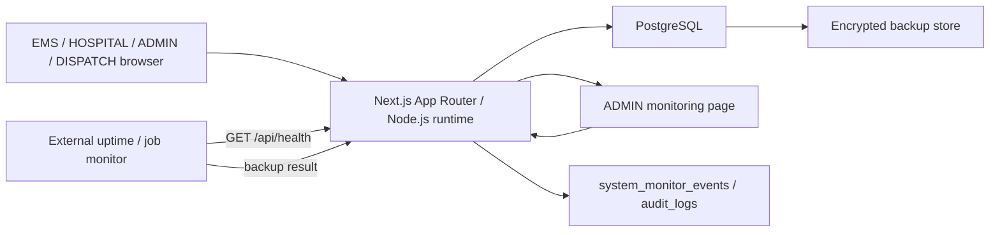

# インフラ構成説明

## 目的

- 導入先や関係者へ説明できる最小構成資料を用意する。

## 本番構成

## 構成要素

- フロントエンド / サーバー: Next.js App Router
- アプリ実行基盤: Node.js runtime
- DB: PostgreSQL
- DB at-rest 暗号化: 本番では managed PostgreSQL の storage encryption を必須にする
- 認証: Auth.js Credentials + WebAuthn MFA
- 監視: `/admin/monitoring`、`system_monitor_events`、外部 uptime / job monitor
- バックアップ: PostgreSQL backup job + encrypted backup store + backup run report

## 主なデータ経路

1. 利用者がブラウザからログインする
2. HOSPITAL は WebAuthn MFA と端末登録を通過する。EMS は端末登録を通過する
3. アプリが role / scope / session / device を判定する
4. PostgreSQL に事案、要請、通知、監査、認証補助データを保存する
5. 外部監視が `/api/health` を確認する
6. backup job が `/api/admin/monitoring/backup-runs` へ結果を報告する

## 主な保存データ

- 事案
- 受入要請
- 要請 target
- 相談履歴
- 患者一覧
- 通知
- 監査ログ
- 認証補助データ
- WebAuthn credential
- 端末登録情報
- backup run report
- 監視イベント

## 運用補助

- バックアップ:
  - 12:00 / 24:00
  - `npm run backup:report -- --status success --job postgres-noon-backup`
- 監視:
  - `ADMIN / 監視`
  - `GET /api/health`
- 端末運用:
  - 登録済み端末ベース
- 環境分離:
  - `local / staging / production` を分ける
- secret:
  - 環境ごとに別 secret を使い、共有しない
- 保存データ暗号化:
  - production PostgreSQL は provider の storage encryption を有効化する
  - backup store は server-side encryption または同等の暗号化を必須にする
  - DB dump は匿名化なしで local / staging に持ち込まない
  - 列単位暗号化は初期構成では入れず、患者氏名、住所、自由記載所見、相談コメントを候補として別設計で扱う

## 補足

- IdP は現時点では前提にしない
- 外部監視 SaaS の製品名は固定しないが、uptime、backup job、DB 接続、通知失敗を監視対象にする
- secret rotation、環境分離、監視通知先は運用 runbook を正本にする

## 関連文書

- [environment-separation-policy.md](/C:/practice/medical-support-apps/docs/policies/environment-separation-policy.md)
- [monitoring-alerting-runbook.md](/C:/practice/medical-support-apps/docs/operations/monitoring-alerting-runbook.md)
- [secret-rotation-runbook.md](/C:/practice/medical-support-apps/docs/operations/secret-rotation-runbook.md)
- [backup-restore-runbook.md](/C:/practice/medical-support-apps/docs/operations/backup-restore-runbook.md)
